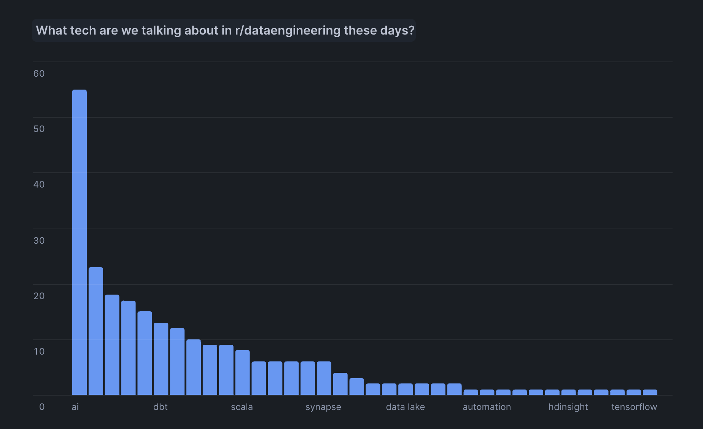

# Reddit Trend Tracker

An AWS Lambda-based project that tracks trends from any subreddit by analyzing posts and comments for keyword mentions. The project collects daily snapshots and stores them in Snowflake for trend analysis.


## Overview
- Analyzes posts and their highest-scoring comments from a specified subreddit
- Uses configurable keyword list stored in S3
- Runs daily via EventBridge
- Stores results in Snowflake for historical trend analysis
- Implements incremental loading (one snapshot per day)
- Configurable post and comment fetching size

## Example Use Case & Output
- Tracking most talked about technology from r/dataengineering
- See the technology_keywords.csv in the templates directory



## Prerequisites

### 1. AWS Account Setup
1. Install AWS CLI:
   ```bash
   # For macOS
   brew install awscli
   
   # Configure AWS CLI with your credentials
   aws configure
   ```

2. Create IAM Role and Policies:
   ```bash
   # Create role
   aws iam create-role \
     --role-name RedditTrendTrackerRole \
     --assume-role-policy-document '{"Version": "2012-10-17","Statement": [{"Effect": "Allow","Principal": {"Service": "lambda.amazonaws.com"},"Action": "sts:AssumeRole"}]}'

   # Attach necessary policies
   aws iam attach-role-policy \
     --role-name RedditTrendTrackerRole \
     --policy-arn arn:aws:iam::aws:policy/service-role/AWSLambdaBasicExecutionRole

   # Create custom policy for S3 and Secrets Manager (save as policy.json)
   aws iam put-role-policy \
     --role-name RedditTrendTrackerRole \
     --policy-name CustomAccessPolicy \
     --policy-document file://policy.json
   ```

3. Create S3 Bucket and Upload Keywords:
   ```bash
   # Create bucket (replace with your-s3-bucket)
   aws s3 mb s3://your-s3-bucket --region your-aws-region

   # Create keywords file with words you want to track (replace with your subreddit)
   echo "python\naws\ndataengineering" > keywords.csv

   # Upload to S3 (your-s3-key-path should match KEYWORDS_KEY in config.py)
   aws s3 cp keywords.csv s3://your-s3-bucket/your-s3-key-path


5. Set up Secrets Manager:
   ```bash
   # Create secret (replace values in json)
   aws secretsmanager create-secret \
     --name "snowflake/credentials" \
     --description "Snowflake credentials for Reddit Tracker" \
     --secret-string '{
       "user": "your_snowflake_user",
       "password": "your_password",
       "account": "your_account.region",
       "warehouse": "your_warehouse",
       "database": "your_database",
       "schema": "your_schema"
     }'
   ```

### 2. Snowflake Setup

1. Connect to Snowflake:
   ```sql
   -- Login as ACCOUNTADMIN
   USE ROLE ACCOUNTADMIN;
   ```

2. Create Database Objects:
   ```sql
   -- Create database and schema
   CREATE DATABASE IF NOT EXISTS your_database;
   CREATE SCHEMA IF NOT EXISTS your_database.your_schema;

   -- Create role and user
   CREATE ROLE reddit_tracker_role;
   CREATE USER reddit_tracker_user PASSWORD = 'choose a smart password';
   
   -- Grant permissions
   GRANT ROLE reddit_tracker_role TO USER reddit_tracker_user;
   GRANT USAGE ON WAREHOUSE compute_wh TO ROLE reddit_tracker_role;
   GRANT USAGE ON DATABASE your_database TO ROLE reddit_tracker_role;
   GRANT USAGE ON SCHEMA your_database.your_schema TO ROLE reddit_tracker_role;
   
   -- Create table
   CREATE TABLE your_database.your_schema.REDDIT_TRENDS (
       SNAPSHOT_TIME TIMESTAMP_NTZ,
       SNAPSHOT_DATE DATE,
       KEYWORD STRING,
       MENTION_COUNT INTEGER
   );
   
   -- Grant table permissions
   GRANT SELECT, INSERT ON TABLE your_database.your_schema.REDDIT_TRENDS 
   TO ROLE reddit_tracker_role;
   ```

### 3. Reddit API Setup
1. Go to https://www.reddit.com/prefs/apps
2. Click "Create Application" or "Create Another App"
3. Fill in:
   - Name: RedditTrendTracker
   - Type: Script
   - Description: Tracks technology trends
   - About URL: (leave blank)
   - Redirect URI: http://localhost:8080
4. Note down:
   - client_id (under your app name)
   - client_secret
   - user_agent (use: "script:RedditTrendTracker:v1.0")

## Project Setup

1. Clone and Setup Environment:
   ```bash
   # Clone repository
   git clone https://github.com/your-username/reddit-tech-tracker.git
   cd reddit-tech-tracker

   # Create virtual environment
   python -m venv venv
   source venv/bin/activate  # On Windows: venv\Scripts\activate

   # Install dependencies
   pip install -r requirements.txt
   ```

2. Create Configuration:
   ```bash
   # Copy template
   cp config_template.py config.py

   # Edit config.py with your values
   nano config.py
   ```

3. Create Lambda Deployment Package:
   ```bash
   # Clear any existing packages
   rm -rf package lambda_deployment.zip

   # Install dependencies to package directory
   pip install --target ./package praw snowflake-connector-python

   # Create deployment package
   cd package
   zip -r ../lambda_deployment.zip .
   cd ..
   zip -g lambda_deployment.zip lambda_function.py config.py
   ```

4. Create Lambda Function:
   ```bash
   # Create function
   aws lambda create-function \
     --function-name RedditTechTracker \
     --runtime python3.9 \
     --handler lambda_function.lambda_handler \
     --role arn:aws:iam::YOUR_ACCOUNT_ID:role/RedditTrendTrackerRole \
     --zip-file fileb://lambda_deployment.zip \
     --timeout 300 \
     --memory-size 512

   # Add environment variables
   aws lambda update-function-configuration \
     --function-name RedditTechTracker \
     --environment "Variables={
       REDDIT_CLIENT_ID=your_client_id,
       REDDIT_CLIENT_SECRET=your_client_secret,
       REDDIT_USER_AGENT=script:RedditTrendTracker:v1.0
     }"
   ```

5. Set up Daily Trigger:
   ```bash
   # Create EventBridge rule (8 AM EST daily)
   aws events put-rule \
     --name DailyRedditTrendAnalysis \
     --schedule-expression "cron(0 13 * * ? *)"

   # Get rule ARN
   RULE_ARN=$(aws events describe-rule --name DailyRedditTrendAnalysis --query 'Arn' --output text)

   # Add Lambda permission
   aws lambda add-permission \
     --function-name RedditTechTracker \
     --statement-id DailyRedditTrendAnalysis \
     --action lambda:InvokeFunction \
     --principal events.amazonaws.com \
     --source-arn $RULE_ARN
   ```

## Testing

1. Test Lambda Function:
   ```bash
   # Invoke function
   aws lambda invoke \
     --function-name RedditTechTracker \
     --payload '{}' \
     --cli-read-timeout 300 \
     output.json

   # Check output
   cat output.json
   ```

2. Check Snowflake Results:
   ```sql
   -- Most mentioned keywords
   SELECT KEYWORD, SUM(MENTION_COUNT) as TOTAL_MENTIONS
   FROM REDDIT_TRENDS
   GROUP BY KEYWORD
   ORDER BY TOTAL_MENTIONS DESC
   LIMIT 10;
   ```

## Maintenance

1. Update Lambda Code:
   ```bash
   # Update deployment package
   zip -g lambda_deployment.zip lambda_function.py config.py

   # Update function
   aws lambda update-function-code \
     --function-name RedditTechTracker \
     --zip-file fileb://lambda_deployment.zip
   ```

2. Stop Daily Execution:
   ```bash
   # Disable rule (temporary)
   aws events disable-rule --name DailyRedditTrendAnalysis

   # Or delete completely
   aws events remove-targets --rule DailyRedditTrendAnalysis --ids "1"
   aws events delete-rule --name DailyRedditTrendAnalysis
   ```

## Troubleshooting

1. Check CloudWatch Logs:
   ```bash
   # Get log group name
   aws logs describe-log-groups \
     --log-group-name-prefix "/aws/lambda/RedditTechTracker"

   # Get recent logs
   aws logs get-log-events \
     --log-group-name "/aws/lambda/RedditTechTracker" \
     --log-stream-name $(aws logs describe-log-streams \
       --log-group-name "/aws/lambda/RedditTechTracker" \
       --order-by LastEventTime \
       --descending --limit 1 \
       --query 'logStreams[0].logStreamName' \
       --output text)
   ```

2. Common Issues:
   - "Missing config.py": Create config.py from template
   - "Unable to import module 'lambda_function'": Rebuild deployment package
   - "Snowflake connection error": Verify credentials in Secrets Manager
   - "S3 access denied": Check IAM role permissions
