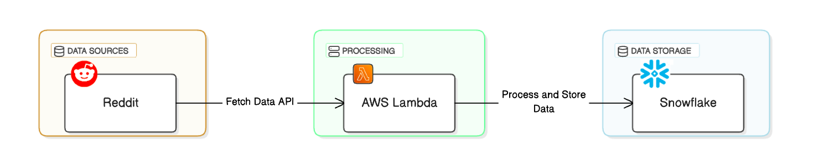
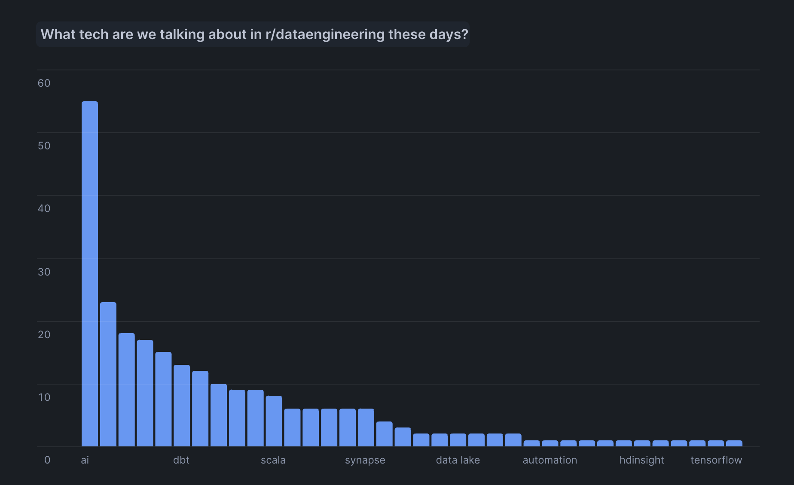

# Reddit Technology Trend Tracker

An AWS Lambda-based project that tracks technology trends from any subreddit by analyzing posts and comments for keyword mentions. The project collects daily snapshots and stores them in Snowflake for trend analysis.



## Overview
- Analyzes posts and their highest-scoring comments from a specified subreddit
- Uses configurable keyword list stored in S3
- Runs daily via EventBridge
- Stores results in Snowflake for historical trend analysis
- Implements incremental loading (one snapshot per day)
- Configurable post and comment analysis depth



## Prerequisites

### AWS Setup
1. IAM Role Setup
   - Create Lambda execution role with permissions for:
     - CloudWatch Logs
     - S3 bucket access
     - Secrets Manager access

2. S3 Bucket
   - Create bucket for keyword storage
   - Upload keywords CSV file (one keyword per line)
   - Set appropriate bucket policies

3. Secrets Manager
   - Create secret for Snowflake credentials with structure:
     ```json
     {
       "user": "your_snowflake_user",
       "password": "your_snowflake_password",
       "account": "your_account.region",
       "warehouse": "your_warehouse",
       "database": "your_database",
       "schema": "your_schema"
     }
     ```

### Snowflake Setup
1. Create database and schema
2. Create user and role:
   ```sql
   -- Create role and user
   CREATE ROLE your_role;
   CREATE USER your_user PASSWORD = 'your_password';
   
   -- Grant necessary privileges
   GRANT ROLE your_role TO USER your_user;
   GRANT USAGE ON WAREHOUSE your_warehouse TO ROLE your_role;
   GRANT USAGE ON DATABASE your_database TO ROLE your_role;
   GRANT USAGE ON SCHEMA your_schema TO ROLE your_role;
   GRANT SELECT ON ALL TABLES IN SCHEMA your_schema TO ROLE your_role;
   ALTER USER your_user SET DEFAULT_ROLE = your_role;
   
   -- Create table
   CREATE TABLE your_schema.REDDIT_TRENDS (
       SNAPSHOT_TIME TIMESTAMP_NTZ,
       SNAPSHOT_DATE DATE,
       KEYWORD STRING,
       MENTION_COUNT INTEGER
   );
   ```

### Reddit API Setup
1. Create Reddit account
2. Create application at https://www.reddit.com/prefs/apps
3. Note down:
   - client_id
   - client_secret
   - user_agent (your app name)

## Configuration

1. Create config.py from config_template.py:
   ```python
   # AWS Settings
   REGION_NAME = "us-west-2"              # Your AWS region
   SECRET_NAME = "snowflake/credentials"  # Name of your Secrets Manager secret

   # S3 Settings
   BUCKET_NAME = "your-bucket-name"       # S3 bucket containing keywords
   KEYWORDS_KEY = "path/keywords.csv"     # Path to keywords file in bucket

   # Reddit Settings
   SUBREDDIT_NAME = "your_subreddit"      # Subreddit to analyze
   POST_LIMIT = 100                       # Number of posts to analyze
   INITIAL_COMMENT_FETCH = 50             # Initial comments to fetch per post
   TOP_COMMENTS_LIMIT = 10                # Number of top comments to analyze
   ```

   The configuration allows you to:
   - Control which subreddit to analyze
   - Adjust how many posts to process
   - Set how many comments to initially fetch (INITIAL_COMMENT_FETCH)
   - Define how many top-scoring comments to analyze (TOP_COMMENTS_LIMIT)

## Installation

1. Clone repository
2. Create virtual environment:
   ```bash
   python -m venv venv
   source venv/bin/activate  # On Windows: venv\Scripts\activate
   pip install -r requirements.txt
   ```

## Deployment

1. Create Lambda deployment package:
   ```bash
   pip install --target ./package praw snowflake-connector-python
   cd package
   zip -r ../lambda_deployment.zip .
   cd ..
   zip -g lambda_deployment.zip lambda_function.py config.py
   ```

2. Create Lambda function:
   - Runtime: Python 3.9
   - Memory: 512MB
   - Timeout: 5 minutes
   - Environment variables:
     - REDDIT_CLIENT_ID
     - REDDIT_CLIENT_SECRET
     - REDDIT_USER_AGENT

3. Set up daily trigger:
   ```bash
   # Create EventBridge rule (runs daily at 8 AM EST)
   aws events put-rule \
       --name "DailyRedditTrendAnalysis" \
       --schedule-expression "cron(0 13 * * ? *)"
   
   # Add Lambda permission
   aws lambda add-permission \
       --function-name YourFunctionName \
       --statement-id DailyRedditTrendAnalysis \
       --action lambda:InvokeFunction \
       --principal events.amazonaws.com \
       --source-arn <EventBridge-Rule-ARN>
   ```

## How It Works

1. Daily Analysis:
   - Function runs each morning
   - Analyzes previous day's posts and comments
   - Skips dates that are already processed

2. Comment Analysis:
   - Fetches initial batch of comments per post (INITIAL_COMMENT_FETCH)
   - Sorts comments by score
   - Analyzes top N comments (TOP_COMMENTS_LIMIT)
   - Only processes comments from the target date

3. Data Storage:
   - Stores results with both snapshot time and date
   - Prevents duplicate data through date checking
   - Maintains historical trend data

## Example Queries

Analyze trends in Snowflake:
```sql
-- Most mentioned keywords overall
SELECT KEYWORD, SUM(MENTION_COUNT) as TOTAL_MENTIONS
FROM REDDIT_TRENDS
GROUP BY KEYWORD
ORDER BY TOTAL_MENTIONS DESC;

-- Trending keywords by date
SELECT SNAPSHOT_DATE, KEYWORD, MENTION_COUNT
FROM REDDIT_TRENDS
ORDER BY SNAPSHOT_DATE DESC, MENTION_COUNT DESC;
```

## Stopping the Schedule

To stop daily execution:
```bash
# Disable the EventBridge rule
aws events disable-rule --name "DailyRedditTrendAnalysis"

# Or delete it completely
aws events remove-targets --rule DailyRedditTrendAnalysis --ids "1"
aws events delete-rule --name DailyRedditTrendAnalysis
```
